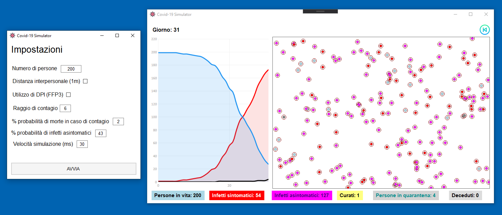

# Covid-19 Simulation

This is a simulation of the "Covid-19" virus behavior. This simulation is for illustrative purposes only and has no scientific or medical value.

## Getting Started

If you want to contribute to the project, download it and open it from [Visual Studio 2019](https://visualstudio.microsoft.com/it/vs/).

### Prerequisites

* [Visual Studio 2019](https://visualstudio.microsoft.com/it/vs/)

### Preview

## Built With

* [Live Charts](https://lvcharts.net/) - Chart library used

## Authors

* **Francesco Cesari**

See also the list of [contributors](https://github.com/francescocesari/Covid-19-Simulation/graphs/contributors) who participated in this project.
